# Chrono SolidWorks Plugin – Improved Installation and Usage Instructions

The [Chrono::SolidWorks](https://api.projectchrono.org/9.0.0/chrono_solidworks_installation.html) add-in enables direct export of SolidWorks assemblies for multibody simulation in the Chrono C++ environment.

---

## Requirements

- **Operating System:** Windows 10 or 11  
- **SolidWorks:** Supported versions 2011 onwards (64-bit)  
- **Add-in Installer:** Provided in `acsl-physics-sim/libraries/chrono-solidworks-plugin/`  

> [!IMPORTANT]
> - You must use a Windows system with a native SolidWorks installation. SolidWorks is not stable on VMs or via Wine on Linux.
> - The add-in provided is for Chrono 9.0.1. Compatibility with other Chrono versions is not guaranteed; see [Chrono releases](https://github.com/projectchrono/chrono/releases) for details.
> - SolidWorks v2023 and v2024 are tested and supported; later version may also work.

---

## Installation

1. **Clone the repository** as specified in the main [README](/README.md).
2. **Run the installer** from `acsl-physics-sim/libraries/chrono-solidworks-plugin/`.  
   - The installer auto-detects SolidWorks and registers the add-in.
   - No need to change installation location or parameters.

  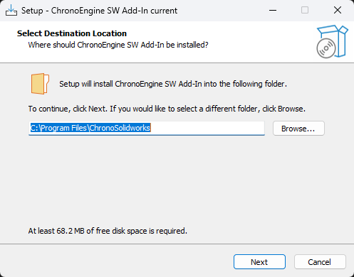

<em>SolidWorks Add-in Installer Prompt – Hit Next</em>

> [!NOTE]
> The installer should auto-detect SolidWorks. If not, ensure SolidWorks is installed and try again.

After installation, look for the Chrono add-in icon in the right-side SolidWorks Task Pane.

  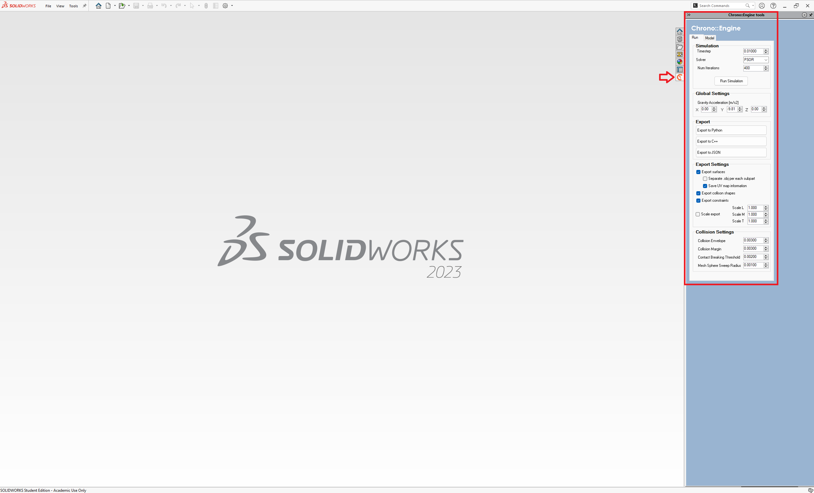

<em>SolidWorks Add-in Pane</em>

---

# Chrono SolidWorks Plugin – Usage Instructions

> [!IMPORTANT]
> **Before Exporting:**
> - **Units**:  Please make sure your model is in SI units for easier workflow.
> - **Export only from Assemblies:** Do not export from single Parts.
> - **SubAssemblies:** Treated as single rigid bodies unless set as Flexible in SolidWorks.
> - **Motors:** Defined via Coordinate Systems at the top assembly level (not inside Parts).
> - **Collision:** Disabled by default; must be enabled per Solid Body (not per Part).
> - **Primitive Collision Shapes:** Assigning a primitive collision shape will set the material of the selected body to `Air`.

---

## Adding Collision Shapes

> [!NOTE]
> Collision detection and contact calculations are computationally expensive. Only flag bodies as `collidable` if necessary.

> [!TIP]
>  If you encounter issues, consult the [Chrono::SolidWorks User Manual](https://api.projectchrono.org/9.0.0/manual_chrono_solidworks.html) or the [GitHub repository](https://github.com/projectchrono/chrono-solidworks)

**Best Practice:**  
  For complex bodies, wrap them with a simple primitive (box, sphere, cylinder) as a separate solid body. The wrapper's material is set to `Air` to avoid double-counting mass or inertia.

**To enable collision on a body:**
1. Expand the Part tree in SolidWorks, locate the relevant Solid Body, and select it.
2. In the Chrono add-in panel, choose the type of collision shape:
   - **Primitive Shape (preferred):** Automatically detected if the body matches a basic shape. The body is set to air material and made semi-transparent.
   - **Mesh (do not use unless necessary):** For complex shapes, a mesh is auto-generated. For best simulation performance, consider replacing the mesh with a hand-optimized one post-export.

> [!TIP]
> After enabling collision, a custom label is prefixed to the solid body name. Do not modify this prefix.
> Undoing collision assignment may not be possible with the standard Undo function—double-check before applying.

---

## Adding Motors

Chrono motors are defined by placing a `Coordinate System` (Assembly tab → Reference Geometry) at the top assembly level.

**To add a Chrono motor:**
1. In the Chrono add-in, click **Motors**.
2. Select the desired motor type and its governing function.
3. Select a top-level Coordinate System and click **Add marker**.
4. Select the slave and master Parts and assign them accordingly.
5. Click **Create motor**.

- A custom property appears under the selected Coordinate System. Use the **Motors > Select Marker** button to edit or remove motor properties.
- These properties are ignored by SolidWorks installations lacking the Chrono add-in.

> [!TIP]
> It is not recommended to add the motors using the plug-in. Instead, define the axis frame in solidworks and add the motors later in code.

---

## Customize Export Settings

- **Separate .obj for each subpart:**  
  Assemblies or Parts with multiple solid bodies can export as individual mesh files or as a single combined mesh.
- **Export Scale:**  
  The plugin automatically converts units to SI (meters, kilograms, seconds). The scale setting allows further adjustment if needed.

> [!TIP]
> It is recommended to export as separate objects.
---

## Example Workflow

This example uses a quadrotor biplane designed at the Advanced Control Systems Lab (ACSL), Virginia Tech.

> [!TIP]
> Exported models can be imported into Chrono for simulation. However, color information from SolidWorks is not preserved in the `.obj` files. To restore colors, follow the [Blender post-processing instructions](/manual/instructions/blender-instructions.md).

### 1. Export Assembly as Single Part (Excluding Propellers)

- **Remove the propellers** from the final assembly file you have created for the UAV.
- **Export the assembly file** for the entire model as a single part (without propellers).

### 2. Simplify the Exported Part

- **Open the exported part file.**
- **Delete all complex geometric bodies** as shown in the figures below.
  

  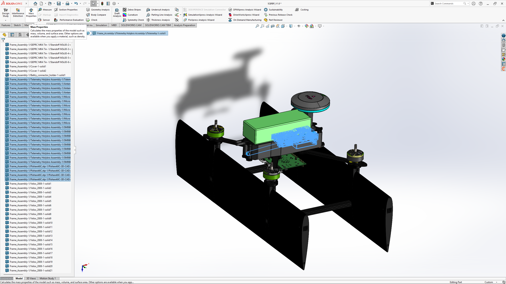

<em>Remove complex parts like the electronics</em>

  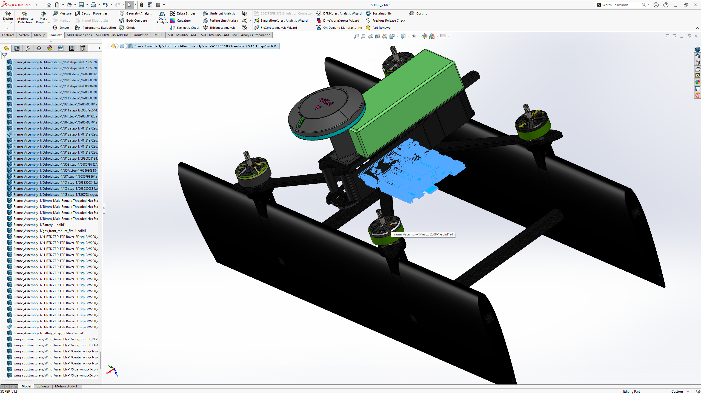

<em>Remove complex parts like the flight computer</em>

  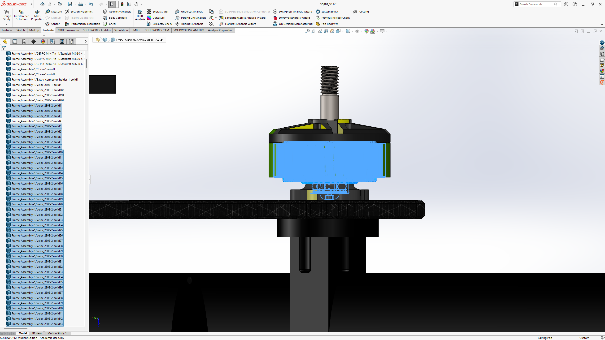

<em>Remove the internals of the motors</em>

  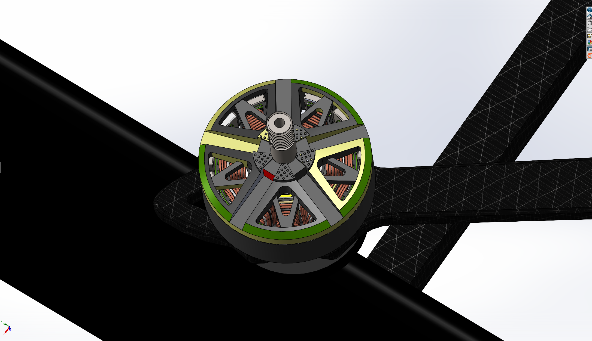

<em>Internals of the motors before the removal of internal bodies</em>

  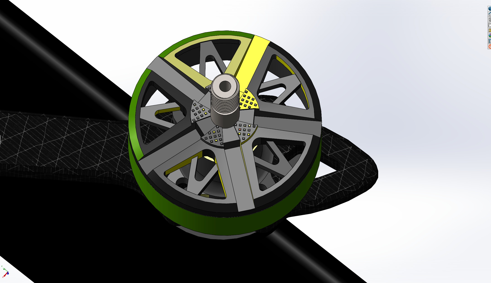

<em>Internals of the motors after the removal of internal bodies</em>

  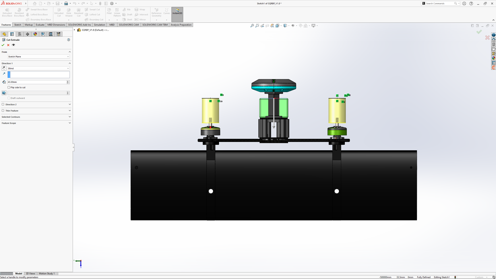

<em>Trim the screw threads on the motors by an extrusion cut</em>

### 3. Combine and Save the Simplified Part

- **Combine the remaining bodies into a single body.**
- **Save the part file.**

  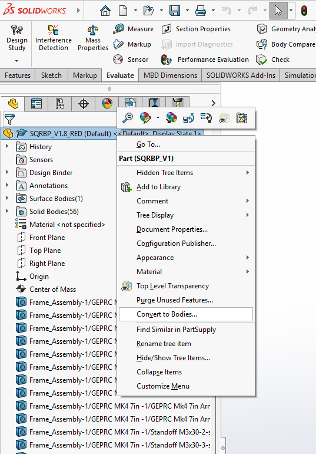

<em>Combine the bodies to a single body part</em>

  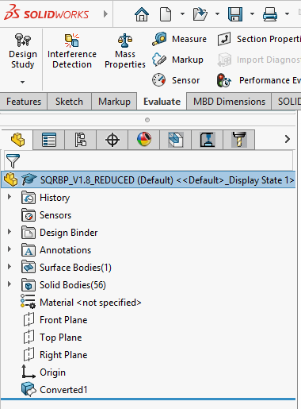

<em>How it looks after the bodies are combined</em>

### 4. Create Primitive Collision Shapes

- **Open the combined and simplified UAV body part** (without propellers).
- **Create primitive collision shapes** as needed.

  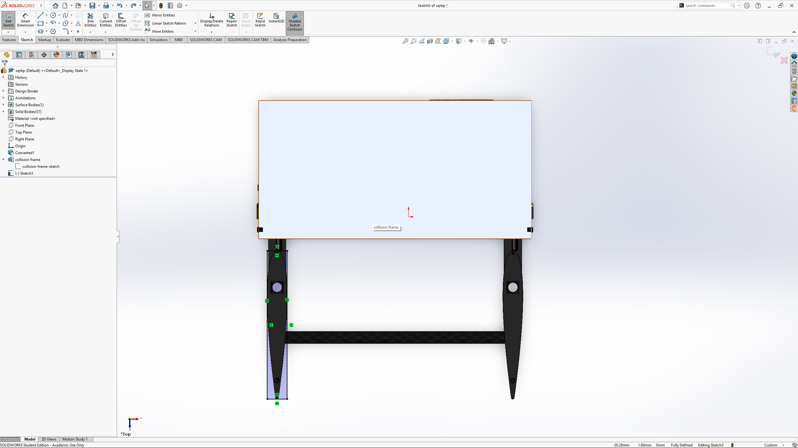

<em>Create sketches about the potentional collision zones</em>

  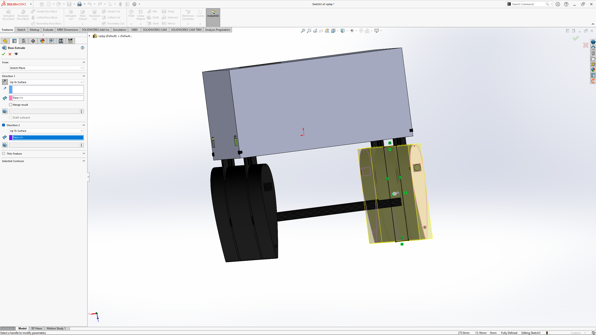

<em>Unpick the merge bodies option during extrusion</em>

  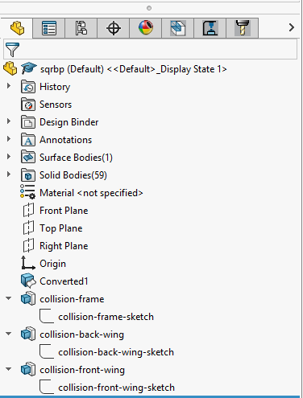

<em>How collision shapes look in the tree</em>

### 5. Save and Exit

- **Save your changes.**
- **Exit the part file.**

### 6. Create a New Assembly for the creation of the Chrono assets

- **Open a new assembly file.**
- **Import the propellers** according to their real-life positions.

### 7. Mate Propellers to Drone Body

- **Use concentric and coincident mates** to attach the propellers to the drone body.

  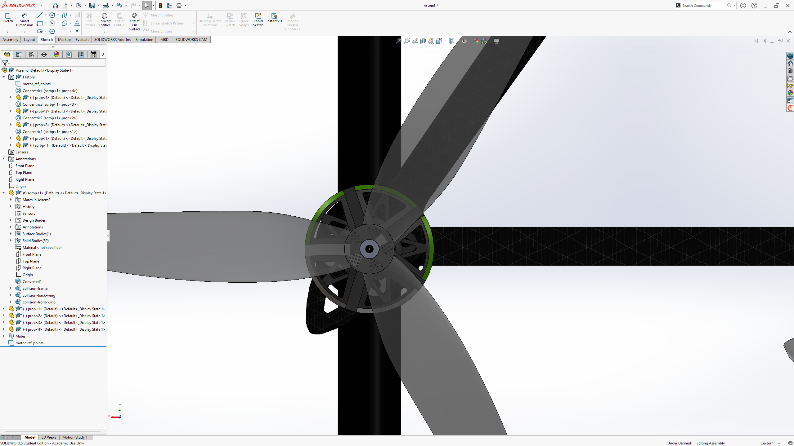

<em>Mate the propellers to the motor using concentric and coincident mates</em>

### 8. Sketch Motor Centers

- **After mating, open a sketch on the plane of the motors.**
- **Add points to represent the centers of each motor.**

### 9. Create Reference Frames for Motors

- **Create reference frames for the motors** using:  
  `Insert > New Reference Frame > Axis`
- **Select each motor center point and place the axes.**

  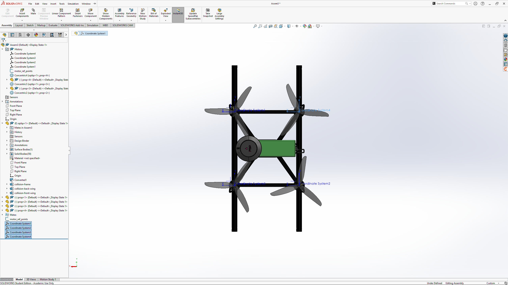

<em>Create motor frames</em>

### 10. Set Drone Body as "Float"

- **Set the drone body part as "float"** (not fixed) in the assembly.

### 11. Prepare for chrono::SolidWorks Plugin

- **You are now ready to use the chrono::SolidWorks plugin.**
- **First, set the collision shapes.**

### 12. Assign Collision Shapes

- **Expand the drone part in the tree.**
- **Select the bodies that correspond to the collision shape extrusions** created in step 4.
- **Set them as primitive collision shapes.**

### 13. Export Model and Generate Code

- **Export the model.**
- **Generate code (choose C++ or Python) for Project Chrono** based on your preferred language.

### 14. Done

- **You have completed the workflow.**

  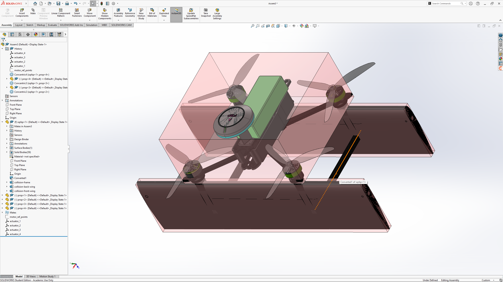

<em>Final output of solidworks assembly after exporting to code</em>

---

## 📝 License

The Chrono Project SolidWorks plug-in is licensed under the BSD 3-Clause License. See the  for details.

---

<!--
# Additional Comments

- Only export from Assemblies, not Parts.
- For performance, use primitive collision shapes wherever possible.
- Always double-check collision assignments before exporting.
-.
-->
